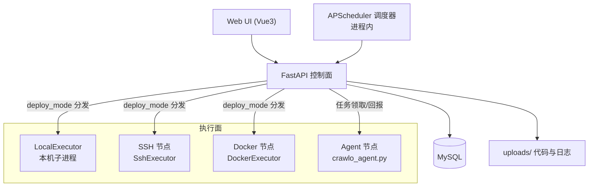
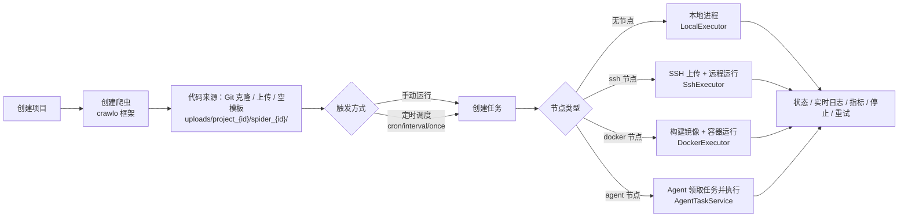

# 🕷️ CrawloPilot

> Crawlo 爬虫框架的管理部署平台 —— 本地 / SSH / Docker / Agent 跨节点分发，项目、爬虫、代码、调度、日志一站式管理。


CrawloPilot 是围绕 [Crawlo](https://github.com/crawl-coder/Crawlo) 爬虫框架构建的管理部署平台，
支持本地 / SSH / Docker / Agent 四种执行模式跨节点分发爬虫任务。在 Web 界面上完成
项目与爬虫管理、代码克隆/上传/在线编辑、定时调度、任务全生命周期管控，
并实时查看任务状态、日志与运行指标。

> **Crawlo 版本要求**：`crawlo >= 1.7.3`。1.7.3 完成了核心架构重构（包结构重组、
> 初始化系统子包化），分布式组件（Redis Stream / Failover / Cluster）在该版本后才
> 完全稳定；1.7.2 存在已知的配置路径问题。依赖已按此要求声明（`backend/requirements.txt`）。

## 目录

- [特性](#-特性)
- [架构](#-架构)
- [快速开始](#-快速开始)
- [详细部署](#-详细部署)
- [爬虫部署流程](#-爬虫部署流程)
- [测试](#-测试)
- [文档导航](#-文档导航)
- [项目结构](#-项目结构)
- [路线图](#-路线图)

## ✨ 特性

- **认证与权限**：JWT + RBAC，用户 / 角色 / 团队
- **项目管理**：项目 CRUD、版本、代码文件上传与在线编辑
- **爬虫管理**：爬虫 CRUD、代码文件树/编辑、运行与停止
- **代码来源**：Git 仓库克隆（保留完整仓库）/ ZIP·TAR 上传 / 空模板
- **Git 工作流**：提交 / 推送 / 拉取 / 切换分支，凭据单次注入不落盘
- **Git 凭据体系**：个人凭据（Fernet 加密存储、创建爬虫自动填充）+ 团队机器人凭据池
- **定时调度**：cron / 间隔 / 一次性触发，并发守卫与触发幂等，启停 / 立即执行 / 运行预览
- **四种执行模式**：本地进程 / SSH 远程 / Docker 直连 / Agent 节点，执行器可插拔
- **任务全生命周期**：状态机、实时日志（WebSocket）、暂停 / 恢复 / 停止 / 重试 / 删除
- **Server 实体**：真实服务器 × SSH/Docker/Agent 三种执行通道统一管理
- **运行统计**：自动解析爬虫指标（pages / items / errors），回写爬虫运行记录
- **仪表盘**：项目 / 爬虫 / 任务 / 节点概览

## 🏗️ 架构



核心思想：**控制面只做编排，执行面负责真正运行**。四种执行方式实现同一套执行器契约
（`execute_task / get_task_status / get_task_logs / stop_task`），业务层按任务
`deploy_mode` 分发，新增执行方式无需改编排逻辑。定时调度器与手动运行共用同一条
任务创建/分发链路（`task_service.create_and_run_task`）。

## 🚀 快速开始

前置：Python 3.10+、Node.js 18+、本机或 Docker 版 MySQL 8.0+。

```bash
git clone git@github.com:crawl-coder/CrawloPilot.git
cd CrawloPilot
cp .env.example .env        # 按需修改数据库地址
./start-dev.sh              # 初始化依赖与数据库，启动前后端
```

启动后访问：

- 前端界面：http://localhost:3000（默认账号 `admin / admin123`）
- API 文档：http://localhost:18000/docs
- 健康检查：http://localhost:18000/health

## 📦 详细部署

### 1. 环境要求

| 组件 | 要求 | 说明 |
|------|------|------|
| Python | 3.10+ | 后端运行环境 |
| Node.js | 18+ | 前端构建与开发 |
| MySQL | 8.0+ | 业务数据库（本机或 Docker 均可） |
| Docker | 可选 | 仅「Docker 直连」执行模式与 Compose 部署需要 |

### 2. 准备数据库

**方式 A：本机 MySQL（推荐本地开发）**

创建数据库与账号（以 `.env` 默认配置为例，请按需修改）：

```sql
CREATE DATABASE IF NOT EXISTS crawlo_pilot DEFAULT CHARACTER SET utf8mb4;
CREATE USER IF NOT EXISTS 'crawlopilot'@'%' IDENTIFIED BY 'crawlopilot123';
GRANT ALL PRIVILEGES ON crawlo_pilot.* TO 'crawlopilot'@'%';
FLUSH PRIVILEGES;
```

**方式 B：Docker Compose 启动依赖**

```bash
docker-compose up -d mysql
```

### 3. 配置环境变量

```bash
cp .env.example .env
```

关键配置项（项目根目录 `.env`，**不要提交到 Git**）：

| 变量 | 默认值 | 说明 |
|------|--------|------|
| `MYSQL_HOST` / `MYSQL_PORT` | `127.0.0.1` / `3306` | MySQL 地址 |
| `MYSQL_USER` / `MYSQL_PASSWORD` | `crawlopilot` / `crawlopilot123` | MySQL 账号 |
| `MYSQL_DATABASE` | `crawlopilot` | 业务库名 |
| `SECRET_KEY` | 示例值 | 全局 fallback 密钥，**生产必须更换**（`openssl rand -hex 32`） |
| `JWT_SECRET_KEY` | 空（回退 `SECRET_KEY`） | JWT 签名专用密钥，**生产必须独立设置** |
| `CREDENTIAL_ENCRYPTION_KEY` | 空（回退 `SECRET_KEY`） | Git/SSH 凭据对称加密专用密钥，**生产必须独立设置且长期固定** |
| `ALLOW_OPEN_REGISTER` | `false` | 开放注册开关；`false` 时注册仅 admin 可用（内部平台建议保持关闭） |
| `CRAWLOPILOT_ENV_FILE` | 空 | 显式指定 .env 路径（默认自动探测：仓库根 → CWD） |
| `DEBUG` | `true` | 开发模式；生产改为 `false` |
| `API_PREFIX` | `/api/v1` | API 前缀 |
| `DOCKER_HOST` | `unix:///var/run/docker.sock` | 控制面默认 Docker 连接 |
| `UPLOAD_DIR` | `uploads`（相对 backend 工作目录） | 代码/上传/任务日志根目录，**生产必须改为绝对路径** |
| `TASK_LOG_RETENTION_DAYS` | `30` | 任务日志保留天数，`0` 表示不清理 |

> 注意：`CREDENTIAL_ENCRYPTION_KEY` 用于 Git 凭据的对称加密，一旦启用后**不可变更**，更换会导致历史密文无法解密。建议首次部署时使用 `openssl rand -hex 32` 生成并固定。

### 4. 一键启动（推荐）

```bash
./start-dev.sh            # 启动前后端（默认读取 .env）
./start-dev.sh --restart  # 重启
./start-dev.sh --stop     # 停止
```

脚本自动完成：创建 `.env`（如缺失）→ 安装后端依赖 → 数据库迁移与初始化
（`alembic upgrade head` + `init_db.py`）→ 清理 18000 / 3000 端口旧进程 →
启动后端（uvicorn 热重载）→ 启动前端。

日志位置：`logs/backend.log`、`logs/frontend.log`。

### 5. 手动启动（不依赖脚本）

```bash
# 后端
conda activate crawlo_pilot
cd backend
pip install -r requirements.txt
python init_db.py                         # 初始化表结构与默认账号（首次）
uvicorn app.main:app --host 0.0.0.0 --port 18000

# 前端（另开终端）
cd ../frontend
npm install
npm run dev
```

> 开发模式下 uvicorn 会热重载 `app/` 下的代码；爬虫代码目录 `uploads/` 已排除在
> 重载监控之外（`--reload-exclude <绝对路径>/uploads`），避免编辑爬虫代码导致后端重启、
> 杀掉运行中任务的监控线程。

### 6. Docker Compose 全栈部署

```bash
docker-compose up -d
```

Compose 包含 V1 必需服务：`api-server`（FastAPI）、`frontend`（Nginx 端口 8080）、
`mysql:8.0`，服务间通过内部网络互连，带健康检查与自动重启。

### 7. 验证部署

1. `curl http://localhost:18000/health` 返回正常；
2. 浏览器打开 http://localhost:3000，用 `admin / admin123` 登录；
3. 左侧「项目管理」创建一个项目 →「爬虫管理」创建爬虫 → 上传代码 → 运行，确认有任务记录与日志。

### 8. 生产环境的存储规划

默认所有运行时数据（爬虫代码、上传包、任务日志）都存放在 `UPLOAD_DIR`（默认
`backend/uploads/`）下，目录结构为：

```text
{UPLOAD_DIR}/
├── project_{id}/            # 每个项目一个目录
│   └── spider_{id}/         # 每个爬虫的代码（Git 来源含完整 .git）
└── _task_logs/              # 所有任务的日志 task_{id}.log
```

生产建议：

- **`UPLOAD_DIR` 配置为独立数据盘绝对路径**（如 `/data/crawlopilot/uploads`），
  不要放在应用代码目录里，避免部署更新/镜像重建时数据丢失；
- **多实例控制面**需把 `UPLOAD_DIR` 指向共享存储（NFS / EFS / 云盘），保证代码与日志一致；
- **日志治理**：`TASK_LOG_RETENTION_DAYS` 默认保留 30 天，后台每天自动清理过期日志；
- **备份**：Git 来源的代码可随时重新克隆重建；本地上传的 ZIP 是唯一代码来源，
  建议对 `UPLOAD_DIR` 做定期备份。

爬虫代码通常只有几百 KB ~ 几 MB，万级爬虫占用也在几十 GB 量级；真正需要治理的是
任务日志，保留策略 + 定期清理即可。

### 9. 常见问题

- **端口被占**：18000 / 3000 被旧进程占用时，先 `./start-dev.sh --stop` 或
  `lsof -ti:18000 -ti:3000 | xargs kill -9` 再启动。
- **数据库连接失败**：确认 MySQL 用户对 `crawlo_pilot` 库有权限，且 `.env` 指向的地址可达。
- **环境变量干扰**：若 shell 中导出了 `MYSQL_HOST` 等旧变量，请先 `unset`
  （平台只读取项目根目录 `.env`，但避免歧义）。
- **SQL 日志过多**：`DEBUG=true` 时默认关闭 SQL echo；排查需要时设 `SQL_ECHO=true`。

## 🔁 爬虫部署流程

### 1. 总体流程



### 2. 代码从哪来（代码即配置）

- 三种来源：**Git 仓库克隆**（完整仓库，支持后续提交/推送）、**ZIP/TAR 上传**、**空模板**；
  创建后均可通过「文件管理 / 在线编辑器」继续修改。
- 代码统一存放在 `backend/uploads/project_{id}/spider_{id}/`。
- 项目遵循固定目录规范：`crawlo.cfg`（指定 settings 模块）+ 入口文件 + `spiders/`（爬虫包）。
- 运行、SSH 上传、Docker 镜像构建、Agent 代码包下载都从该目录取代码。

### 3. Git 工作流与凭据

- Git 来源的爬虫保留完整 `.git`，详情页可直接提交、推送、拉取、切换分支；
- 认证凭据仅在单次命令执行时注入（密码拼 URL / SSH 私钥临时文件），**不写回 `.git/config`**；
- 凭据两级管理：**个人凭据**（个人中心配置，Fernet 加密，创建爬虫自动填充）与
  **团队机器人凭据池**（管理员维护，爬虫按 ID 引用，轮换一处生效）。

### 4. 四种执行模式对比

| 模式 | 执行器 | 适用场景 | 特点 |
|------|--------|----------|------|
| 本地 | `LocalExecutor` | 单机开发 / 验收 | 子进程运行，零外部依赖，可暂停/恢复 |
| SSH | `SshExecutor` | 已有云服务器 | 控制面 SSH 上传代码后 `nohup` 运行，按 PID 轮询存活 |
| Docker | `DockerExecutor` | 有 Docker 的服务器 | 直连节点 Docker API，构建任务镜像后运行容器 |
| Agent | `AgentTaskService` | NAT 之后 / 横向扩展 | 节点 agent 反向连接控制面领取任务，无需入站端口 |

### 5. 定时调度

- 在爬虫创建/编辑表单中配置，支持 **cron / 固定间隔 / 一次性**三种触发；
- 进程内 APScheduler 驱动，`schedule` 表持久化，重启自动恢复并做错跑检测；
- 并发守卫（同调度最大并发数）+ 触发幂等（唯一索引兜底），一次触发最多一个任务；
- 支持启停（保留配置）、立即执行、下次运行预览与运行历史。

详细设计见 [docs/designs/scheduling.md](docs/designs/scheduling.md)。

### 6. 节点与真实服务器的关系

- **Server（真实服务器）**：物理/云主机，如 `192.0.2.10:22`，先添加并登记。
- **节点（Node）**：服务器上的一种**执行通道**，一台服务器可以挂多个节点：
  - `ssh` 节点：控制面持有 SSH 凭据，直接远程执行；
  - `docker` 节点：暴露 Docker API（`tcp://host:2375`）后直连；
  - `agent` 节点：在服务器上运行 `agent/crawlo_agent.py`，反向注册并领取任务。
- 节点需要先「测试连接」再「激活」，状态为 `online` 才能被任务选择。

详细设计见 [docs/modules/05-nodes.md](docs/modules/05-nodes.md) 与
[docs/designs/server-management.md](docs/designs/server-management.md)。

### 7. 依赖与 Dockerfile 处理

- **requirements.txt**：四种模式运行前都会检测代码目录下的 `requirements.txt`，
  存在则自动安装，避免运行到一半缺库。
- **项目 Dockerfile（仅 Docker 模式）**：构建策略为「项目 Dockerfile 优先，缺失回退内置模板」：
  - 代码目录存在 `Dockerfile` → 以项目 Dockerfile 构建镜像（`FROM/COPY/CMD` 全由项目决定），
    构建失败自动回退；
  - 没有 Dockerfile → 内置模板（`FROM crawlopilot/base:1.7.3` + COPY 代码 + 装 requirements）；
  - 镜像按 `crawlo-project-{project_id}-{内容摘要}` 缓存，代码不变则秒级复用。
- **启动命令**：配置了 `entry_file` 就精确执行 `python <entry_file>`；
  否则尊重镜像 `ENTRYPOINT/CMD`；内置模板默认 `python run.py`。

### 8. 任务执行与可观测性

- 状态机：`pending → running → success / failed / timeout / cancelled`（本地模式含 `paused`）。
- 日志：执行器统一落盘 `uploads/_task_logs/task_{id}.log`，容器/Agent 清理后仍可查询；
  执行详情页通过 WebSocket 实时推送日志与状态。
- 指标：自动从日志解析 `pages / items / errors`（兼容 crawlo 1.6/1.7 统计格式），
  任务结束后回写爬虫运行记录。
- 控制：运行中可停止 / 重试，全部按 `deploy_mode` 分发到对应执行器。

执行细节见 [docs/modules/04-execution.md](docs/modules/04-execution.md)。

## ✅ 测试

```bash
# 部署流程验收（18 项）
python tests/test_deployment_flow.py

# 前后端全流程联调（41 项，覆盖 13 个页面接口）
python tests/full_flow_test.py

# 定时调度端到端（35 项，含真实触发，约 4 分钟）
python tests/schedule_test.py

# Git 凭据体系端到端（34 项）
python tests/git_credentials_test.py
```

完整测试说明见 [docs/modules/08-testing.md](docs/modules/08-testing.md)。

## 📚 文档导航

README 覆盖部署与使用主线；设计、实现与运维细节在 `docs/` 中按模块展开：

| 文档 | 说明 |
|------|------|
| [文档索引](docs/README.md) | 全部文档入口与推荐阅读顺序 |
| [变更记录](CHANGELOG.md) | 版本变更记录（Keep a Changelog） |
| [设计哲学](docs/design-philosophy.md) | 为什么这样设计、核心决策 |
| [产品设计](docs/product-design.md) | 产品定位、功能模块、技术方案 |
| [部署执行](docs/modules/04-execution.md) | 四种执行器流程、Docker 构建策略、指标解析 |
| [节点管理](docs/modules/05-nodes.md) | 真实服务器 × SSH/Docker/Agent 通道设计 |
| [Server 管理设计](docs/designs/server-management.md) | 真实服务器实体管理方案 |
| [任务管理](docs/modules/06-tasks.md) | 任务状态机、实时日志、定时调度 |
| [定时调度设计](docs/designs/scheduling.md) | 方案 A：模型 / 引擎 / 幂等 / 生命周期同步 |
| [爬虫管理](docs/modules/03-spiders.md) | 代码目录规范、文件管理、运行控制 |
| [测试](docs/modules/08-testing.md) | 部署流程验收与自动化测试 |
| [Agent 使用说明](agent/README.md) | 节点 Agent 部署手册 |

## 📁 项目结构

```text
CrawloPilot/
├── backend/            # FastAPI 后端（API / 服务 / 模型 / 执行器）
│   ├── app/
│   │   ├── api/v1/     # 路由：认证/项目/爬虫/调度/执行/节点/服务器/凭据/Agent
│   │   ├── services/   # 业务与执行器（local/ssh/docker/agent/scheduler/git）
│   │   └── models/     # SQLAlchemy 模型
│   └── uploads/        # 爬虫代码与任务日志（运行时数据，不入库）
├── frontend/           # Vue3 前端
├── agent/              # 节点 Agent 程序（纯标准库）
├── spider-runner/      # 兜底 Docker 基础镜像构建目录（非主链路，主链路由本地 wheel 构建）
├── docker/             # Docker 配置（mysql 初始化等）
├── docs/               # 设计哲学 / 产品设计 / 模块文档
├── examples/           # 示例爬虫（ofweek_standalone）
├── tests/              # 端到端与单元测试
└── docker-compose.yml
```

## 🗺️ 路线图

**V1（已完成）**：项目 / 爬虫 / 四种执行模式 / 任务与日志 / Server 实体 / 定时调度 / Git 工作流与凭据体系

**V2（规划）**：调度管理增强、监控告警、代理池 / API 管理、操作审计

详见 [docs/remaining-work.md](docs/remaining-work.md)。

## 🤝 贡献

欢迎提交 Issue 和 Pull Request。开发前请先阅读 [docs/](docs/README.md) 下的设计哲学与模块文档。

## 📄 License

[MIT](LICENSE)
