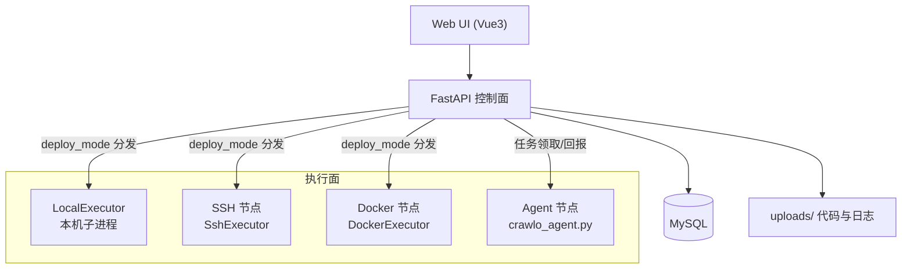

> 📖 [docs 首页](README.md) ｜ 📘 下一篇：[产品设计](product-design.md)

# CrawloPilot 设计哲学

> 一句话：**CrawloPilot 是爬虫的"编排面"，不是爬虫本身。它负责把代码送到执行面、跑起来、看得到，其余功能按需生长。**

## 1. 核心理念

### 1.1 执行链路优先，管理功能次之

V1 只承诺一件事：**从"创建项目"到"看到爬虫日志"的完整链路必须真实可用**。

因此 V1 初期裁剪掉了 Git 管理、调度系统、监控告警、数据质量、代理池、API 管理、
操作审计等"锦上添花"的功能——它们大多依赖外部组件（Celery Worker、Prometheus、通知渠道）
或本身就是半成品。裁剪不是否定这些功能，而是**让第一版可被完整验证**。数据库表保留，可平滑恢复。

> 后续进展（2026-08-07）：Git 工作流与定时调度已以更轻的形态回归 V1
> （完整仓库 + 凭据单次注入；进程内 APScheduler 替代 Celery 依赖），
> 监控告警/代理池/API 管理/审计仍在 V2 规划中（见 [remaining-work.md](remaining-work.md)）。

### 1.2 执行器可插拔：控制面只做编排

爬虫的执行方式被抽象成**统一的执行器契约**：

```text
execute_task(config)  启动
get_task_status(id)   查状态
get_task_logs(id)     读日志
stop_task(id)         停止
```

四个实现等价替换，按任务 `deploy_mode` 分发：

| deploy_mode | 执行器 | 说明 |
|-------------|--------|------|
| `local` | LocalExecutor | 本机子进程，无任何外部依赖 |
| `ssh` | SshExecutor | 控制端 SSH 远程执行 |
| `docker` | DockerExecutor | 直连节点 Docker API |
| `agent` | AgentTaskService | 节点 agent 反向执行并回报 |

业务代码（`run_spider`、任务 API、WebSocket）只面向契约编程，新增执行方式不需要改动编排逻辑。

### 1.3 本地优先，渐进式分布式

默认执行方式是**本地进程**，不依赖 Docker、Celery、Worker。

这带来三个结果：

- 单机即可完整验证全链路（验收测试不依赖任何容器）
- 需要分布式时按节点类型渐进接入：先 SSH（零改造），再 Docker（直连 API），最后 Agent（反向注册）
- 架构上不把"必须要有某套基础设施"作为前提

### 1.4 控制面与执行面分离

平台（控制面）负责：任务编排、状态记录、日志汇聚、权限。
节点（执行面）负责：真正跑爬虫。

体现在 Agent 模式上最明显：**节点上的 agent 反向连接控制端**，
控制端不持有节点的 SSH 凭据，节点可以位于 NAT 之后，加机器 = 部署 agent。

### 1.5 代码即配置：上传即部署

爬虫项目遵循固定的目录规范。执行入口由 `entry_file` 决定（如 `run.py`），
若未指定则尝试 `crawlo run <spider_name>`，否则自动发现
`run.py`/`main.py`/`crawl.py`/`start.py`。

**`crawlo.cfg` 仅在使用 Crawlo 框架（`crawlo run`）时才必需**——它指定
`settings.py` 等配置模块。若爬虫用 `run.py` 等独立脚本入口（Scrapy、
Selenium 等），则无需 `crawlo.cfg`：

```text
project_1/spider_2/
├── crawlo.cfg              # 仅使用 Crawlo 框架时必需（指定 settings）
├── run.py                  # 入口（entry_file）
└── <package>/              # 爬虫包（含 spiders/）
    └── settings.py         # SPIDER_MODULES 等配置
```

代码通过文件接口上传到 `uploads/project_{id}/spider_{id}/`，
运行、SSH 上传、Docker 镜像构建、Agent 代码包下载都从这个目录取代码。
**平台不把 Git 当作必选**，本地文件就是单一事实来源。

### 1.6 任务为中心的可观测性

一切运行痕迹都挂在**任务（TaskInstance）**上：

- 状态机：`pending → running → success / failed / timeout / cancelled`（含 paused）
- 日志：执行器统一落盘到 `uploads/_task_logs/task_{id}.log`，API 按模式读取
- 实时性：WebSocket 推送日志行与状态增量；前端轮询兜底
- 指标：从日志解析 `pages / items / errors`（兼容 crawlo 1.6/1.7 两种统计格式）
- 归属：任务关联爬虫，任务结束后回写爬虫运行统计（last_run / 成功失败计数）

### 1.7 简单即正确

- 能用标准库就不引依赖（Agent 程序纯 stdlib）
- 能用文件解决就不上存储服务（日志落盘 > 日志系统；MinIO/Prometheus/ELK 全部移出 V1）
- 接口宁可少一个，不可多一个假的（V1 删除所有返回 mock 数据的端点）
- 状态字段语义明确：爬虫 `status`（启用态）与任务 `status`（运行态）分离

### 1.8 节点提供环境，镜像内容由项目决定

Docker 部署里有两层职责，刻意分开：

- **Docker 节点是"在哪里跑"**：一个 daemon API 端点，只提供运行环境，不感知项目内容；
  任意多个项目可以复用同一个节点。
- **项目 Dockerfile 是"跑什么"**：定义任务镜像（基础镜像、依赖、启动命令），
  跟随代码仓库，与具体节点无关。

因此执行时**项目 Dockerfile 优先、缺失时回退内置模板**：
自带 Dockerfile 的项目完全掌控镜像；没有 Dockerfile 的项目也能零配置开箱即用。
镜像按 `crawlo-project-{project_id}-{内容摘要}` 缓存，代码不变则秒级复用。

## 2. 架构分层



## 3. 关键设计决策

| 决策 | 理由 |
|------|------|
| 默认本地进程执行 | 单机可验证全链路；不把 Docker/Celery 作为前提 |
| 调度系统先裁后回 | 原实现依赖 Celery Worker（无 Worker 时任务永远不跑）；后改为进程内 APScheduler + DB 持久化回归，零额外组件 |
| Docker 用"基础镜像复用 + 任务镜像 COPY" | 每次任务都 `pip install crawlo` 从源码编译极慢且脆弱；wheel 免编译、秒级构建 |
| 项目 Dockerfile 优先，缺失回退内置模板 | 节点只负责"在哪里跑"，镜像内容由项目决定；零 Dockerfile 项目也开箱即用 |
| 任务镜像按内容摘要缓存 | 同一项目连续运行不重复构建，代码变化自动重建，旧镜像可回滚 |
| Agent 反向连接 | 控制端不持有节点凭据、穿透 NAT、横向扩展成本最低 |
| 状态/日志/停止按 deploy_mode 分发 | 执行器契约统一，业务层与执行方式解耦 |
| 日志统一落盘 `uploads/_task_logs` | 四种执行器日志同一读取路径；容器/agent 清理后日志仍在 |
| 任务结束后回写爬虫统计 | 列表页/详情页的运行统计不需要额外聚合查询 |
| 裁剪功能但保留数据库表 | V2 恢复成本低，避免破坏性删除 |

## 4. 演进原则

1. **新功能必须能在本地模式跑通**，再谈分布式形态
2. **先契约后实现**：执行器接口不变，新增部署方式只加一个实现
3. **可观测性随执行器走**：任何执行方式都要有状态、日志、停止
4. **V2 顺序**（2026-08-07 更新）：调度增强（全局视图/终态统计）→ 监控告警 → 平台化（代理池/API 管理/审计/生产化）；Git 管理与调度本体已在 V1 交付
